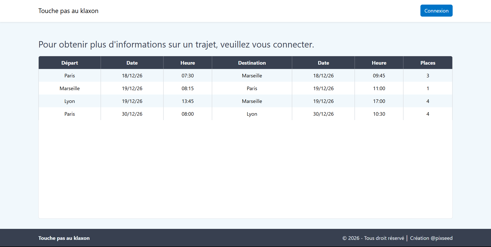
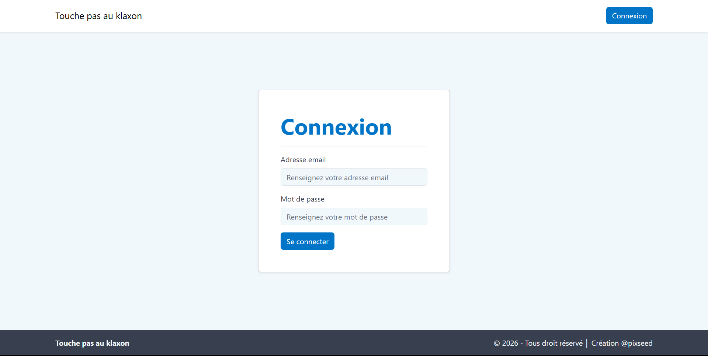
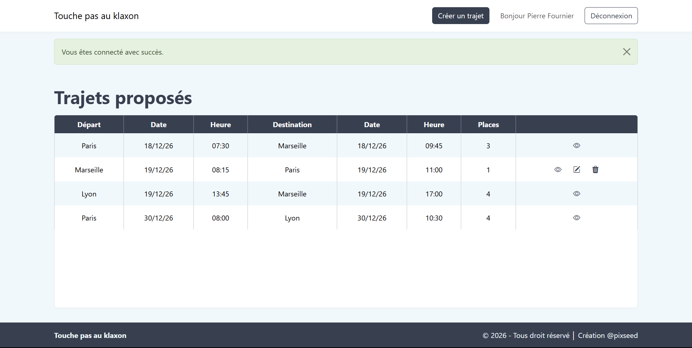
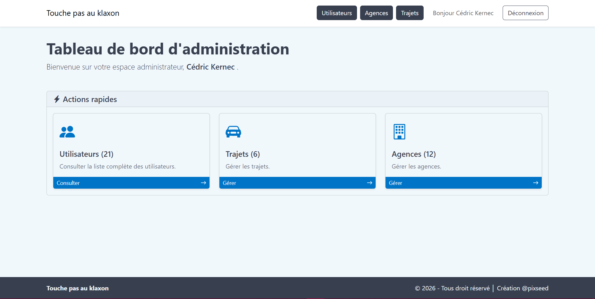
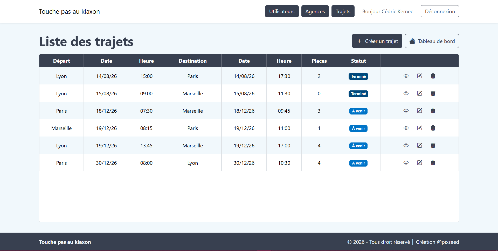
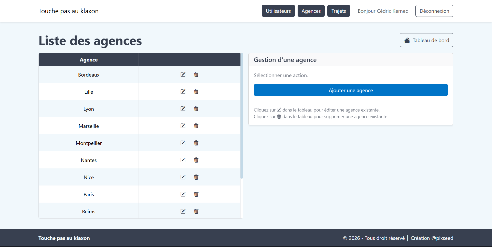
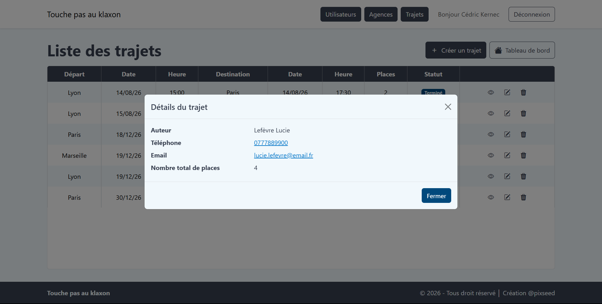
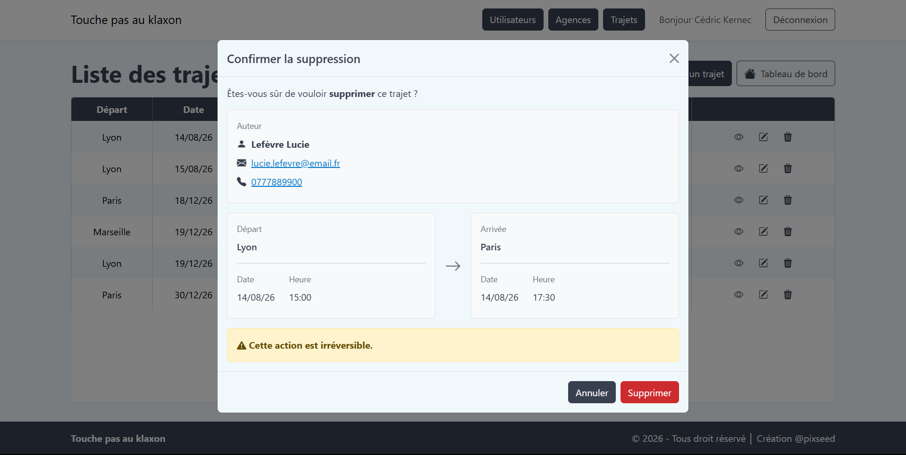
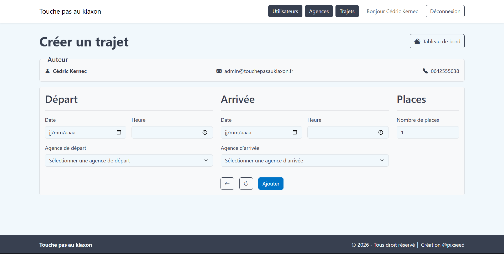

# Devoir 10 - Mise en place d'une application MVC en PHP


[](LICENSE)

Projet réalisé dans le cadre de la formation **Développeur Web et Web Mobile (DWWM)** du *Centre Européen de Formation (CEF)*.

**Touche pas au klaxon** est une application de covoiturage interne développée en PHP orienté objet selon une architecture MVC.

L'application permet aux utilisateurs de consulter et de proposer des trajets entre différentes agences. Une interface d'administration permet également de gérer les trajets et les agences.

---

## Sommaire

- [Devoir 10 - Mise en place d'une application MVC en PHP](#devoir-10---mise-en-place-dune-application-mvc-en-php)
  - [Sommaire](#sommaire)
  - [Technologies](#technologies)
  - [Architecture du projet](#architecture-du-projet)
  - [Fonctionnalités](#fonctionnalités)
    - [Visiteur](#visiteur)
    - [Utilisateur authentifié](#utilisateur-authentifié)
    - [Administrateur](#administrateur)
  - [Aperçu de l'application](#aperçu-de-lapplication)
  - [Prérequis](#prérequis)
  - [Installation](#installation)
    - [1. Cloner le dépôt](#1-cloner-le-dépôt)
    - [2. Installer les dépendances PHP](#2-installer-les-dépendances-php)
    - [3. Installer les dépendances JavaScript](#3-installer-les-dépendances-javascript)
    - [4. Configurer les variables d'environnement](#4-configurer-les-variables-denvironnement)
    - [5. Initialiser la base de données](#5-initialiser-la-base-de-données)
    - [6. Compiler Sass (optionnel)](#6-compiler-sass-optionnel)
    - [7. Démarrer le serveur](#7-démarrer-le-serveur)
  - [Base de données](#base-de-données)
  - [Qualité du code](#qualité-du-code)
    - [Analyse statique](#analyse-statique)
    - [Tests automatisés](#tests-automatisés)
  - [Documentation](#documentation)
  - [Informations](#informations)

---

## Technologies

| Technologie | Version |
|-------------|---------|
| PHP | |
| Buki Router |  |
| MySQL |  |
| Composer | |
| Bootstrap |  |
| Sass |  |
| Dotenv |  |
| PHPStan |  |
| PHPUnit |  |

L'application utilise Composer pour la gestion des dépendances PHP et l'autoload PSR-4, Buki Router pour le routage ainsi que npm pour la gestion de Sass et Bootstrap.

---

## Architecture du projet

```
├─ App
│  ├─ Constants
│  │  ├─ FormMode.php
│  │  └─ Role.php
│  ├─ Controller
│  │  ├─ AdminController.php
│  │  ├─ AgencyController.php
│  │  ├─ AuthController.php
│  │  ├─ ErrorController.php
│  │  ├─ HomeController.php
│  │  ├─ TripController.php
│  │  └─ UserController.php
│  ├─ Core
│  │  ├─ AbstractController.php
│  │  ├─ AbstractModel.php
│  │  └─ Database.php
│  ├─ Helpers
│  │  └─ DateHelper.php
│  ├─ Model
│  │  ├─ AgencyModel.php
│  │  ├─ TripModel.php
│  │  └─ UserModel.php
│  └─ Validators
│     ├─ AgencyValidator.php
│     ├─ AuthValidator.php
│     └─ TripValidator.php
│
├─ config
│  ├─ app.php
│  ├─ database.php
│  ├─ init.php
│  └─ routes.php
│
├─ database
│  ├─ init.php
│  ├─ queries.sql
│  ├─ schema.sql
│  └─ seed.sql
│
├─ docs
│  ├─ assets
│  │  ├─ MCD.jpg
│  │  ├─ MLD.png
│  │  └─ touche-pas-au-klaxon_cycle-de-traitement-d-une-requete.jpg
│  ├─ briefs
│  │  ├─ BRIEF-devoir-10-touche-pas-au-klaxon.pdf
│  │  ├─ CONSIGNES-devoir-10-touche-pas-au-klaxon.png
│  │  └─ OBJECTIFS-devoir-10-touche-pas-au-klaxon.png
│  ├─ src
│  │  ├─ MLD_touche-pas-au-klaxon.drawio
│  │  └─ MLD_touche-pas-au-klaxon.mwb
│  ├─ styles
│  │  └─ markdown-pdf.css
│  ├─ project.md
│  └─ project.pdf
│
├─ public
│  ├─ assets
│  │  ├─ css
│  │  │  └─ style.css
│  │  ├─ js
│  │  │  ├─ bootstrap.bundle.min.js
│  │  │  └─ main.js
│  │  └─ scss
│  │     ├─ abstracts
│  │     │  └─ _variables.scss
│  │     ├─ base
│  │     │  ├─ _global.scss
│  │     │  └─ _reset.scss
│  │     ├─ components
│  │     │  ├─ _buttons.scss
│  │     │  ├─ _flash.scss
│  │     │  └─ _tables.scss
│  │     ├─ layout
│  │     │  ├─ _footer.scss
│  │     │  └─ _header.scss
│  │     ├─ pages
│  │     │  ├─ _dashboard.scss
│  │     │  └─ _error.scss
│  │     ├─ vendors
│  │     │  └─ _bootstrap.scss
│  │     └─ style.scss
│  ├─ .htaccess
│  └─ index.php
│
├─ templates
│  ├─ admin
│  │  ├─ partials
│  │  │  └─ _actionCard.php
│  │  ├─ _actions.php
│  │  └─ index.php
│  ├─ agency
│  │  ├─ _form.php
│  │  └─ index.php
│  ├─ auth
│  │  └─ login.php
│  ├─ errors
│  │  └─ 404.php
│  ├─ home
│  │  └─ index.php
│  ├─ layouts
│  │  └─ app.php
│  ├─ partials
│  │  ├─ header
│  │  │  ├─ _admin_menu.php
│  │  │  ├─ _guest_menu.php
│  │  │  ├─ _login_button.php
│  │  │  ├─ _logo.php
│  │  │  ├─ _logout_button.php
│  │  │  ├─ _user_infos.php
│  │  │  └─ _user_menu.php
│  │  ├─ modals
│  │  │  ├─ _deleteAgencyModal.php
│  │  │  ├─ _deleteTripModal.php
│  │  │  └─ _tripDetailsModal.php
│  │  ├─ _flash.php
│  │  ├─ _footer.php
│  │  ├─ _header.php
│  │  ├─ _modal.php
│  │  └─ _pageHeader.php
│  ├─ trip
│  │  ├─ _form.php
│  │  ├─ create.php
│  │  ├─ edit.php
│  │  └─ index.php
│  └─ user
│     └─ index.php
│
├─ tests
│  ├─ Database
│  │  └─ TestDatabase.php
│  ├─ Model
│  │  ├─ AgencyModelTest.php
│  │  └─ TripModelTest.php
│  └─ bootstrap.php
│
├─ .env.example
├─ composer.json
├─ composer.lock
├─ LICENSE
├─ package-lock.json
├─ package.json
├─ phpstan.neon
├─ phpunit.xml
└─ README.md
```

L'application suit une architecture MVC :

- `App/Controller/` contient les contrôleurs chargés de traiter les requêtes.
- `App/Model/` contient les modèles responsables de l'accès aux données.
- `App/Validators/` contient les règles de validation des données issues des formulaires.
- `App/Core/` contient les composants techniques communs aux contrôleurs et aux modèles.
- `App/Constants/` centralise les constantes utilisées par l'application.
- `App/Helpers/` contient les fonctions utilitaires réutilisables.
- `config/` contient la configuration de l'application, de la base de données et des routes.
- `templates/` contient les vues de l'application.
- `public/` constitue le point d'entrée public de l'application et contient les ressources front-end.
- `database/` contient les scripts nécessaires à la création et à l'initialisation de la base de données.
- `tests/` contient l'environnement et les tests automatisés réalisés avec PHPUnit.

## Fonctionnalités

### Visiteur

- Consulter les trajets disponibles à venir
- Se connecter à l'application

### Utilisateur authentifié

- Consulter les trajets disponibles à venir
- Consulter les informations détaillées d'un trajet
- Créer un trajet
- Modifier ses propres trajets
- Supprimer ses propres trajets
- Se déconnecter

### Administrateur

- Consulter l'ensemble des trajets
- Consulter les informations détaillées d'un trajet
- Créer, modifier et supprimer les trajets
- Consulter, créer, modifier et supprimer les agences
- Consulter la liste des utilisateurs

---

## Aperçu de l'application

<table>
  <tr>
    <td align="center" width="50%">
      
      <br>
      <strong>Accueil</strong>
    </td>
    <td align="center" width="50%">
      
      <br>
      <strong>Connexion</strong>
    </td>
  </tr>

  <tr>
    <td align="center" width="50%">
      
      <br>
      <strong>Espace utilisateur</strong>
    </td>
    <td align="center" width="50%">
      
      <br>
      <strong>Tableau de bord administrateur</strong>
    </td>
  </tr>

  <tr>
    <td align="center" width="50%">
      
      <br>
      <strong>Gestion des trajets</strong>
    </td>
    <td align="center" width="50%">
      
      <br>
      <strong>Gestion des agences</strong>
    </td>
  </tr>

  <tr>
    <td align="center" width="50%">
      
      <br>
      <strong>Détails d'un trajet</strong>
    </td>
    <td align="center" width="50%">
      
      <br>
      <strong>Suppression d'un trajet</strong>
    </td>
  </tr>

  <tr>
    <td align="center" width="50%">
      
      <br>
      <strong>Création d'un trajet</strong>
    </td>
    <td align="center" width="50%">
    </td>
  </tr>
</table>

---

## Prérequis

Avant d'installer le projet, les outils suivants doivent être disponibles :

- PHP 8.2 ou supérieur avec les extensions PDO (`pdo`) PDO MySQL (`pdo_mysql`)
- MySQL 8 avec un compte disposant des privilèges nécessaires à la création et à la suppression d'une base de données
- Composer
- Node.js et npm
- Un serveur web Apache (XAMPP, WampServer ou équivalent) avec le module `mod_rewrite` activé et la prise en charge des fichiers `.htaccess`

---

## Installation

### 1. Cloner le dépôt

```bash
git clone https://github.com/pixseed/kernec-cedric-devoir-10-mise-en-place-d-une-application-mvc-en-php.git
cd kernec-cedric-devoir-10-mise-en-place-d-une-application-mvc-en-php
```

### 2. Installer les dépendances PHP

```bash
composer install
```

### 3. Installer les dépendances JavaScript

```bash
npm install
```

### 4. Configurer les variables d'environnement

Créer le fichier `.env` à partir du fichier d'exemple :

```bash
cp .env.example .env
```

Puis renseigner dans `.env` les paramètres correspondant au serveur MySQL utilisé :

- l'hôte du serveur
- le port MySQL
- le nom de la base de données
- l'utilisateur MySQL
- le mot de passe MySQL

Le compte MySQL utilisé doit disposer des privilèges permettant la création et la suppression de base de données.

### 5. Initialiser la base de données

Une fois les paramètres MySQL renseignés dans `.env`, initialiser la base avec :

```bash
composer db:init
```

La base de données configurée est automatiquement créée et alimentée avec les données de démonstration.

> [!WARNING]
> Cette commande supprime entièrement la base de données configurée dans `.env` si elle existe déjà avant de la recréer. Elle doit donc être utilisée uniquement pour initialiser ou réinitialiser l'environnement de développement.

### 6. Compiler Sass (optionnel)

La feuille de style compilée est déjà incluse dans le projet. Pour modifier les fichiers Sass et recompiler automatiquement les styles :

```bash
npm run sass
```

### 7. Démarrer le serveur

Démarrer Apache et MySQL à l'aide d'un environnement local tel que XAMPP ou WampServer.

Le projet doit être accessible depuis le dossier `public/` qui constitue le point d'entrée de l'application.

Par exemple, avec XAMPP et le projet placé dans `htdocs/touche-pas-au-klaxon/` :

```
http://localhost/touche-pas-au-klaxon/public/
```

L'application utilise le fichier `public/.htaccess` pour rediriger les requêtes vers `public/index.php`. Le serveur Apache doit donc disposer du module `mod_rewrite` activé et autoriser l'utilisation des fichiers `.htaccess`.

---

## Base de données

La structure et les données initiales de l'application sont définies dans :

- `database/schema.sql` : création des tables et des contraintes
- `database/seed.sql` : insertion des données de démonstration
- `database/init.php` : création et initialisation de la base de données

La base de données peut être entièrement recréée et initialisée automatiquement avec :

```bash
composer db:init
```

Cette commande :
- se connecte au serveur MySQL à partir des paramètres définis dans `.env`
- supprime la base de données si elle existe déjà
- recrée la base de données
- exécute le script `schema.sql` pour créer les tables et leurs contraintes
- exécute le script `seed.sql` pour insérer les données de démonstration
- vérifie le nombre d'enregistrements présents dans chaque table

---

## Qualité du code

### Analyse statique

L'analyse statique du code PHP est réalisée avec PHPStan :

```bash
composer analyse
```
### Tests automatisés

Les tests automatisés sont réalisés avec PHPUnit :

```bash
composer test
```

Les tests d'intégration des modèles utilisent une base de données MySQL dédiée afin de vérifier les opérations d'écriture sans modifier les données de l'application. La base de test est recréée automatiquement avant chaque test.

---

## Documentation

La documentation du projet est disponible dans le dossier [`docs/`](docs/).

Elle comprend notamment :

- le cahier de projet au format Markdown : [`docs/Kernec_Cedric_Devoir_10_Touche_pas_au_klaxon.md`](docs/Kernec_Cedric_Devoir_10_Touche_pas_au_klaxon.md)
- le cahier de projet exporté au format PDF : [`docs/Kernec_Cedric_Devoir_10_Touche_pas_au_klaxon.pdf`](docs/Kernec_Cedric_Devoir_10_Touche_pas_au_klaxon.pdf)
- les ressources graphiques utilisées dans la documentation : [`docs/assets/`](docs/assets/)
- les fichiers sources des schémas de conception : [`docs/src/`](docs/src/)
- le brief et les consignes fournis pour la réalisation du projet : [`docs/briefs`](docs/briefs)

---

## Informations

| Élément | Valeur |
|----------|--------|
| Version |  |
| Auteur |   |
| Licence | [](LICENSE) |
| Formation |  |