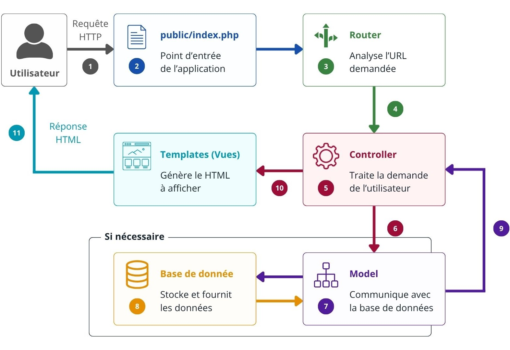
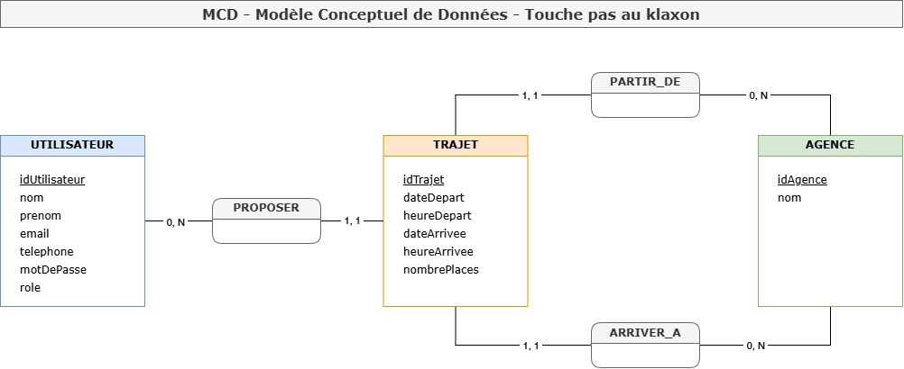
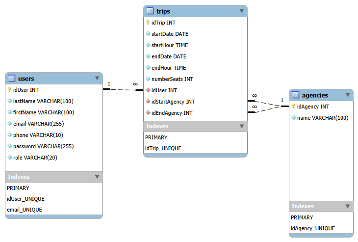

<h1>Projet : Touche pas au klaxon</h1>

<h2>
  Devoir #10 :<br>
  Mise en place d'une application MVC en PHP
</h2>

<div class="panel panel--grid-2-col panel--center cover__meta">

  <div class="panel__label">Auteur</div>
  <div class="panel__value">Cédric Kernec</div>

  <div class="panel__label">GitHub</div>
  <div class="panel__value"><a href="https://github.com/pixseed" target="_blank" rel="noopener noreferrer">https://github.com/pixseed</a></div>

  <div class="panel__label">Formation</div>
  <div class="panel__value">Développeur Web & Web Mobile (DWWM)</div>

  <div class="panel__label">Établissement</div>
  <div class="panel__value">Centre Européen de Formation (CEF)</div>

  <div class="panel__label">Technologies</div>
  <div class="panel__value">PHP8 • HTML5 • CSS3 • Bootstrap 5 • Sass • MySQL</div>

  <div class="panel__label">Outils</div>
  <div class="panel__value">Composer • Git • GitHub • PHPStan • PHPUnit • VSCode • draw.io • MySQL Workbench</div>

  <div class="panel__label">Version</div>
  <div class="panel__value">1.0.0</div>

  <div class="panel__label">Date</div>
  <div class="panel__value">Juillet 2026</div>

</div>

<div class="page-break"></div>

<nav class="toc">

<h2>Sommaire</h2>

- [1.Présentation du projet](#1présentation-du-projet)
  - [1.1 Description](#11-description)
  - [1.2. Objectif](#12-objectif)
- [2.Contexte](#2contexte)
- [3.Analyse du besoin](#3analyse-du-besoin)
  - [3.1 Besoin métier](#31-besoin-métier)
  - [3.2 Utilisateurs concernés](#32-utilisateurs-concernés)
  - [3.3 Besoins fonctionnels](#33-besoins-fonctionnels)
  - [3.4 Besoins non fonctionnels](#34-besoins-non-fonctionnels)
- [4.Analyse fonctionnelle](#4analyse-fonctionnelle)
  - [4.1 Visiteur](#41-visiteur)
  - [4.2 Utilisateur authentifié](#42-utilisateur-authentifié)
  - [4.3 Administrateur](#43-administrateur)
- [5.Règles métier](#5règles-métier)
  - [5.1 Gestion des trajets](#51-gestion-des-trajets)
  - [5.2 Gestion des utilisateurs](#52-gestion-des-utilisateurs)
  - [5.3 Gestion des droits](#53-gestion-des-droits)
  - [5.4 Authentification](#54-authentification)
- [6.Contraintes techniques](#6contraintes-techniques)
  - [6.1 Technologies utilisées](#61-technologies-utilisées)
  - [6.2 Contraintes de développement](#62-contraintes-de-développement)
  - [6.3 Qualité logicielle](#63-qualité-logicielle)
  - [6.4 Sécurité](#64-sécurité)
- [7.Architecture du projet](#7architecture-du-projet)
  - [7.1 Architecture MVC](#71-architecture-mvc)
  - [7.2 Principe d'organisation](#72-principe-dorganisation)
  - [7.3 Cycle de traitement d'une requête](#73-cycle-de-traitement-dune-requête)
- [8.Modélisation de la base de données](#8modélisation-de-la-base-de-données)
  - [8.1 Tableau de conception](#81-tableau-de-conception)
  - [8.2 Modèle Conceptuel de Données (MCD)](#82-modèle-conceptuel-de-données-mcd)
  - [8.3 Modèle Logique de Données (MLD)](#83-modèle-logique-de-données-mld)
  - [8.4 Dictionnaire des données](#84-dictionnaire-des-données)
    - [Table : `users`](#table--users)
    - [Table : `agencies`](#table--agencies)
    - [Table : `trips`](#table--trips)
  - [Contraintes d'intégrité](#contraintes-dintégrité)
- [9. Organisation du développement](#9-organisation-du-développement)
  - [9.1 Gestion des versions](#91-gestion-des-versions)
  - [9.2 Méthodologie de développement](#92-méthodologie-de-développement)
  - [9.3 Outils utilisés](#93-outils-utilisés)
  - [9.4 Tests](#94-tests)
- [10.Planification](#10planification)
- [11.Livrables](#11livrables)

</nav>

<div class="page-break"></div>

## <span class="section-number">1.</span>Présentation du projet

### 1.1 Description

Le projet **Touche pas au klaxon** consiste à développer une application web de covoiturage interne destinée aux collaborateurs d'une entreprise.

L'application permet de consulter les trajets disponibles, de proposer de nouveaux trajets et d'administrer les données selon les droits accordés à chaque utilisateur.

Ce projet est réalisé dans le cadre du devoir n°10 de la formation Développeur Web et Web Mobile (DWWM) du Centre Européen de Formation (CEF).

### 1.2. Objectif

L'objectif est de concevoir une application respectant une architecture **MVC (Model ─ View ─ Controller)** en PHP orienté objet en appliquant les bonnes pratiques de développement, de sécurité et d'organisation d'un projet web.

---

## <span class="section-number">2.</span>Contexte

L'entreprise possède plusieurs agences réparties sur le territoire. Les collaborateurs sont régulièrement amenés à effectuer des déplacements professionnels entre ces différents sites.

Afin de faciliter l'organisation de ces déplacements, l'entreprise souhaite mettre à disposition une application interne de covoiturage permettant aux collaborateurs de proposer ou de consulter des trajets selon leurs besoins.

L'application devra offrir une interface simple d'utilisation, sécurisée et adaptée aux différents profils d'utilisateurs. Elle devra également permettre aux administrateurs de gérer les données nécessaires au bon fonctionnement du service, notamment les agences et les utilisateurs.

Ce projet s'inscrit dans une démarche de développement durable en favorisant le partage des véhicules, tout en simplifiant l'organisation des déplacements professionnels.

---

<div class="page-break"></div>

## <span class="section-number">3.</span>Analyse du besoin

### 3.1 Besoin métier

L'entreprise souhaite mettre en place une application web permettant d'organiser le covoiturage entre ses collaborateurs lors de leurs déplacements professionnels.

L'application devra permettre aux utilisateurs de consulter les trajets disponibles, de proposer de nouveaux trajets et de gérer ceux dont ils sont les auteurs. Les administrateurs disposeront quant à eux d'outils de gestion afin d'assurer le bon fonctionnement de l'application.

L'objectif est de proposer une solution simple, sécurisée et adaptée aux besoins quotidiens des collaborateurs.

### 3.2 Utilisateurs concernés

L'application distingue trois catégories d'utilisateurs :

| Utilisateur | Description |
| ------------|-------------|
| Visiteur | Consulte les trajets disponibles et peut accéder au formulaire de connexion. |
| Utilisateur authentifié | Gère ses propres trajets et consulte les informations détaillées des trajets disponibles. |
| Administrateur | Dispose des fonctionnalités de gestion des agences, des utilisateurs et de l'ensemble des trajets. |

### 3.3 Besoins fonctionnels

Les principaux besoins identifiés sont les suivants :

- consulter les trajets disponibles ;
- consulter le détail d'un trajet ;
- s'authentifier ;
- créer un trajet ;
- modifier ou supprimer ses propres trajets ;
- administrer les agences ;
- consulter les utilisateurs ;
- gérer l'ensemble des trajets en tant qu'administrateur.

### 3.4 Besoins non fonctionnels

Au-delà des fonctionnalités, l'application devra répondre à plusieurs exigences de qualité :

- garantir la sécurité des accès ;
- assurer la cohérence des données ;
- proposer une interface claire et intuitive ;
- respecter une architecture MVC ;
- produire un code maintenable et documenté ;
- faciliter les évolutions futures de l'application.

---

<div class="page-break"></div>

## <span class="section-number">4.</span>Analyse fonctionnelle

<p class="note">L'analyse fonctionnelle décrit les fonctionnalités mises à disposition des différents profils d'utilisateurs. Chaque rôle dispose de droits spécifiques définissant les actions qu'il est autorisé à réaliser au sein de l'application.</p>

### 4.1 Visiteur

Le visiteur correspond à un utilisateur non authentifié. Son accès est volontairement limité afin de préserver la sécurité des données tout en lui permettant de découvrir le service proposé.

<h4>Fonctionnalités</h4>

| Fonctionnalité | Description |
|----------------|-------------|
| Consulter les trajets | Affiche uniquement les trajets futurs disposant encore de places disponibles. |
| Accéder à la connexion | Permet de s'authentifier afin d'accéder aux fonctionnalités avancées. |

### 4.2 Utilisateur authentifié

Une fois connecté, un collaborateur peut gérer ses propres trajets et consulter les informations détaillées des trajets proposés par les autres collaborateurs.

<h4>Fonctionnalités</h4>

| Fonctionnalité | Description |
|----------------|-------------|
| Consulter le détail d'un trajet | Accéder aux informations complètes d'un trajet. |
| Créer un trajet | Publier un nouveau trajet. |
| Modifier un trajet | Modifier uniquement les trajets dont il est l'auteur. |
| Supprimer un trajet | Supprimer uniquement les trajets dont il est l'auteur. |

### 4.3 Administrateur

L'administrateur dispose de droits étendus lui permettant d'assurer le bon fonctionnement de l'application.

<h4>Fonctionnalités</h4>

| Fonctionnalité | Description |
|----------------|-------------|
| Consulter les utilisateurs | Afficher la liste des collaborateurs. |
| Gérer les agences | Créer, modifier et supprimer les agences. |
| Consulter tous les trajets | Visualiser l'ensemble des trajets enregistrés. |
| Supprimer un trajet | Supprimer n'importe quel trajet si nécessaire. |

---

<div class="page-break"></div>

## <span class="section-number">5.</span>Règles métier

<p class="note">Les règles métier définissent les contraintes fonctionnelles qui garantissent le bon fonctionnement de l'application. Elles devront être respectées par l'ensemble des fonctionnalités développées.</p>

### 5.1 Gestion des trajets

<ul class="custom-list">
  <li>Un trajet est obligatoirement associé à un utilisateur.</li>
  <li>Un trajet possède une agence de départ et une agence d'arrivée.</li>
  <li>L'agence de départ doit être différente de l'agence d'arrivée.</li>
  <li>La date et l'heure de départ doivent être antérieures à la date et l'heure d'arrivée.</li>
  <li>Le nombre de places disponibles doit être supérieur ou égal à zéro.</li>
  <li>Seuls les trajets à venir disposant encore de places disponibles sont visibles par les visiteurs.</li>
</ul>

### 5.2 Gestion des utilisateurs

<ul class="custom-list">
  <li>Chaque utilisateur possède un compte unique.</li>
  <li>Un utilisateur est identifié par son adresse e-mail.</li>
  <li>Chaque utilisateur possède un rôle déterminant les fonctionnalités auxquelles il a accès.</li>
  <li>Les collaborateurs sont importés depuis un système RH et ne peuvent pas être créés ou supprimés depuis l'application.</li>
</ul>

### 5.3 Gestion des droits

<ul class="custom-list">
  <li>Un utilisateur authentifié peut créer un trajet.</li>
  <li>Un utilisateur authentifié peut uniquement modifier les trajets dont il est l'auteur.</li>
  <li>Un utilisateur authentifié peut uniquement supprimer les trajets dont il est l'auteur.</li>
  <li>Un administrateur peut consulter l'ensemble des trajets.</li>
  <li>Un administrateur peut supprimer n'importe quel trajet.</li>
  <li>Un administrateur est le seul autorisé à gérer les agences.</li>
</ul>

### 5.4 Authentification

<ul class="custom-list">
  <li>Les fonctionnalités de gestion sont accessibles uniquement après authentification.</li>
  <li>Les droits accordés dépendent du rôle de l'utilisateur connecté.</li>
  <li>Les visiteurs ne peuvent accéder qu'aux fonctionnalités publiques de l'application.</li>
</ul>

---

<div class="page-break"></div>

## <span class="section-number">6.</span>Contraintes techniques

<p class="note">Le développement de l'application devra respecter les contraintes techniques définies dans le cahier des charges. Ces contraintes garantissent la cohérence de l'architecture, la qualité du code et la maintenabilité du projet.</p>

### 6.1 Technologies utilisées

| Élément | Technologie |
|----------|-------------|
| Langage | PHP 8 |
| Architecture | MVC (Model - View - Controller) |
| Base de données | MySQL |
| Front-end | HTML5, CSS3, Sass, Bootstrap |
| JavaScript | JavaScript ES6 |
| Gestion des dépendances | Composer |
| Tests | PHPUnit |
| Analyse statique | PHPStan |
| Gestion de versions | Git & GitHub |

### 6.2 Contraintes de développement

<p class="note">Le projet devra respecter les bonnes pratiques de développement afin de garantir un code fiable, lisible et facilement maintenable.</p>

<p><span class="text-underline">Les principales contraintes sont les suivantes</span> :</p>

- respecter l'architecture MVC ;
- privilégier la programmation orientée objet ;
- séparer la logique métier, les vues et les accès aux données ;
- documenter le code lorsque cela est nécessaire ;
- utiliser Git pour assurer le suivi des évolutions du projet ;
- organiser le projet selon une arborescence claire et cohérente.

### 6.3 Qualité logicielle

<p><span class="text-underline">L'application devra répondre à plusieurs critères de qualité</span> :</p>

- produire un code lisible et facilement maintenable ;
- limiter les duplications de code ;
- faciliter les évolutions futures ;
- garantir la cohérence des données manipulées ;

### 6.4 Sécurité

<p><span class="text-underline">L'application devra mettre en œuvre plusieurs mécanismes de sécurité</span> :</p>

- authentification des utilisateurs ;
- gestion des rôles et des autorisations ;
- validation des données saisies ;
- protection contre les injections SQL ;
- protection contre les attaques XSS ;
- protection contre les attaques CSRF ;
- stockage sécurisé des mots de passe.

---

## <span class="section-number">7.</span>Architecture du projet

<p class="note">L'application est développée selon une architecture <span class="text-bold">MVC (Model - View - Controller)</span>. Cette organisation permet de séparer les responsabilités de chaque composant afin de faciliter la maintenance, les évolutions futures et la compréhension du code.<br><br>
Chaque couche possède un rôle bien défini et communique avec les autres selon un fonctionnement précis.</p>

### 7.1 Architecture MVC

<p><span class="text-underline">L'architecture MVC repose sur <span class="text-bold">trois composants principaux</span></span> :</p>

| Composant | Rôle |
|-----------|------|
| Model | Gère les données de l'application, les interactions avec la base de données ainsi que les règles métier. |
| View | Affiche les informations à l'utilisateur et génère les interfaces graphiques. |
| Controller | Reçoit les requêtes des utilisateurs, exécute la logique applicative et fait le lien entre les modèles et les vues. |

Cette séparation des responsabilités permet de rendre le projet plus lisible, plus facilement testable et plus simple à faire évoluer.

### 7.2 Principe d'organisation

Le projet est organisé de manière à séparer les différentes couches de l'application.

Chaque dossier possède un rôle précis afin de limiter les dépendances entre les composants, de faciliter la maintenance du code et d'améliorer sa lisibilité.

Cette organisation repose sur les principes suivants :

- séparation des responsabilités ;
- centralisation des classes communes dans le dossier `Core` ;
- regroupement des contrôleurs, modèles et templates par domaine fonctionnel ;
- utilisation d'un point d'entrée unique (`public/index.php`) ;
- chargement automatique des classes via l'autoloader de Composer.

<p class="note">L'arborescence présentée ci-dessous correspond à l'organisation prévisionnelle du projet. Elle pourra évoluer légèrement au cours du développement en fonction des besoins identifiés.</p>

```
├── App/
│   ├── Controller/
│   │   ├── AdminController.php
│   │   ├── AgencyController.php
│   │   ├── AuthController.php
│   │   ├── HomeController.php
│   │   └── TripController.php
│   │
│   ├── Core/
│   │   ├── Database.php
│   │   ├── AbstractController.php
│   │   └── AbstractModel.php
│   │
│   ├── Model/
│   │   ├── AgencyModel.php
│   │   ├── TripModel.php
│   │   └── UserModel.php
│   │
│   └── Router/
│       └── Router.php
│
├── config/
│   └── database.php
│
├── public/
│   ├── index.php
│   └── assets/
│       ├── css/
│       ├── images/
│       └── js/
│
├── templates/
│   ├── admin/
│   ├── auth/
│   ├── home/
│   ├── layouts/
│   ├── partials/
│   └── trip/
│
├── tests/
│   ├── Controller/
│   └── Model/
│
├── vendor/
│
├── .gitignore
├── composer.json
├── composer.lock
├── phpstan.neon
├── phpunit.xml
└── README.md
```

| Dossier | Rôle | Contenu prévisionnel |
|----------|------|----------------------|
| **App/Controller** | Reçoit les requêtes HTTP et coordonne les traitements de l'application. | `HomeController.php`, `AuthController.php`, `TripController.php`, `AgencyController`, `AdminController.php` |
| **App/Model** | Représente les données métier et assure les interactions avec la base de données. | `UserModel.php`, `TripModel.php`, `AgencyModel.php` |
| **App/Core** | Regroupe les classes communes utilisées par l'ensemble de l'application. | `Database.php`, `AbstractController.php`, `AbstractModel.php` |
| **App/Router** | Gère le routage des requêtes HTTP vers les contrôleurs. | `Router.php` |
| **config** | Centralise les fichiers de configuration de l'application. | `database.php` |
| **public** | Contient le point d'entrée de l'application ainsi que les ressources accessibles depuis le navigateur. | `index.php`, dossier `assets/` |
| **templates** | Regroupe les vues de l'application organisées par domaine fonctionnel. | `home/`, `auth/`, `trip/`, `admin/`, `layouts/`, `partials/` |
| **tests** | Contient les tests unitaires et fonctionnels du projet. | Tests PHPUnit des contrôleurs et modèles |
| **vendor** | Regroupe les dépendances installées via Composer ainsi que l'autoloader. | Dépendances installées automatiquement par Composer ainsi que l'autoloader PSR-4. |

<div class="page-break"></div>

### 7.3 Cycle de traitement d'une requête

<p><span class="text-underline">Lorsqu'un utilisateur effectue une action sur l'application, la requête suit le cheminement suivant</span> :</p>



1. L'utilisateur envoie une requête HTTP.
2. Le point d'entrée `public/index.php` reçoit la requête.
3. Le routeur analyse l'URL demandée.
4. Le routeur appelle le contrôleur correspondant.
5. Le contrôleur traite la demande.
6. Si nécessaire, le contrôleur interroge un modèle.
7. Le modèle communique avec la base de données.
8. La base de données transmet les données au modèle.
9. Les données sont retournées au contrôleur.
10. Le contrôleur transmet les données à un template.
11. Le template génère la réponse HTML renvoyée au navigateur.

---

<div class="page-break"></div>

## <span class="section-number">8.</span>Modélisation de la base de données

L'application s'appuie sur une **base de données relationnelle MySQL**.

Les principales entités manipulées sont :

<ul class="custom-list">
  <li>Utilisateurs</li>
  <li>Agences</li>
  <li>Trajets</li>
</ul>

### 8.1 Tableau de conception

| Entité | Attributs principaux | Relations | Clé primaire |
|--------|----------------------|-----------|--------------|
| Utilisateur | `id`, `nom`, `prenom`, `email`, `telephone`, `motDePasse`, `role` | Propose des trajets  | `id` |
| Agence | `id`, `nom` | Départ et arrivée des trajets | `id` |
| Trajet | `id`, `dateDepart`, `heureDepart`, `dateArrivee`, `heureArrivee`, `nombrePlace` | Proposé par un utilisateur et relie une agence de départ à une agence d'arrivée | `id` |

<p><span class="text-underline">Les principales relations identifiées sont</span> :</p>
<ul class="custom-list">
  <li>Un utilisateur peut proposer <span class="text-bold">0 à N</span> trajets.</li>
  <li>Un trajet est proposé par <span class="text-bold">un seul utilisateur</span>.</li>
  <li>Une agence peut être utilisée comme <span class="text-bold">agence de départ</span> pour <span class="text-bold">0 à N trajets</span>.</li>
  <li>Une agence peut être utilisée comme <span class="text-bold">agence d'arrivée</span> pour <span class="text-bold">0 à N trajets</span>.</li>
  <li>Un trajet possède <span class="text-bold">une seule agence de départ</span> et <span class="text-bold">une seule agence d'arrivée</span>.</li>
</ul>

Ces relations sont représentées dans les modèles de conception présentés ci-dessous.

<div class="page-break"></div>

### 8.2 Modèle Conceptuel de Données (MCD)

Le **Modèle Conceptuel de Données (MCD)** décrit les entités métier ainsi que les relations qui les unissent, indépendamment de toute contrainte technique.



### 8.3 Modèle Logique de Données (MLD)

Le **Modèle Logique de Données (MLD)** traduit le modèle conceptuel en une structure relationnelle compatible avec MySQL.

Il fait notamment apparaître les clés primaires ainsi que les clés étrangères permettant de matérialiser les relations entre les différentes tables.



### 8.4 Dictionnaire des données

Le dictionnaire de données recense les différentes tables de la base de données ainsi que leurs attributs, leurs types de données et les principales contraintes d'intégrité.

#### Table : `users`

| Attribut | Type | Contraintes | Description |
|----------|------|-------------|-------------|
| idUser | INT | PK, AI, NN, UNSIGNED | Identifiant unique de l'utilisateur. |
| lastName | VARCHAR(100) | NN | Nom de famille de l'utilisateur. |
| firstName | VARCHAR(100) | NN | Prénom de l'utilisateur. |
| email | VARCHAR(255) | NN, UNIQUE | Adresse électronique de l'utilisateur. |
| phone | VARCHAR(10) | NN | Numéro de téléphone. |
| password | VARCHAR(255) | NN | Mot de passe chiffré. |
| role | VARCHAR(20) | NN | Rôle de l'utilisateur dans l'application. |

#### Table : `agencies`

| Attribut | Type | Contraintes | Description |
|----------|------|-------------|-------------|
| idAgency | INT | PK, AI, NN, UNSIGNED | Identifiant unique de l'agence. |
| name | VARCHAR(100) | NN | Nom de l'agence. |

#### Table : `trips`

| Attribut | Type | Contraintes | Description |
|----------|------|-------------|-------------|
| idTrip | INT | PK, AI, NN, UNSIGNED | Identifiant unique du trajet. |
| startDate | DATE | NN | Date de départ du trajet. |
| startHour | TIME | NN | Heure de départ du trajet. |
| endDate | DATE | NN | Date d'arrivée du trajet. |
| endHour | TIME | NN | Heure d'arrivée du trajet. |
| numberSeats | INT | NN, UNSIGNED | Nombre de places disponibles. |
| idUser | INT | FK, NN, UNSIGNED | Référence vers l'utilisateur proposant le trajet. |
| idStartAgency | INT | FK, NN, UNSIGNED | Référence vers l'agence de départ. |
| idEndAgency | INT | FK, NN, UNSIGNED | Référence vers l'agence d'arrivée. |

---

### Contraintes d'intégrité

| Contrainte | Description |
|------------|-------------|
| PK | Clé primaire de la table. |
| FK | Clé étrangère assurant l'intégrité référentielle entre les tables. |
| NN | Champ obligatoire (*Not Null*). |
| UNIQUE | Valeur unique dans la table. |
| AI | Valeur générée automatiquement (*Auto Increment*). |
| UNSIGNED | Valeur entière positive uniquement. |

---

## <span class="section-number">9.</span> Organisation du développement

Le développement de l'application est réalisé de manière progressive afin de garantir la qualité du code, la cohérence de l'architecture et le respect des bonnes pratiques de développement.

Le projet est versionné avec **Git** et hébergé sur **GitHub** permettant le suivi des évolutions et la sauvegarde de l'ensemble du code source.

### 9.1 Gestion des versions

Le projet est organisé autour d'un dépôt GitHub.

Les principales bonnes pratiques appliquées sont les suivantes :

- utilisation d'une branche dédiée au développement des fonctionnalités ;
- réalisation de commits réguliers et explicites ;
- utilisation des Issues GitHub pour suivre l'avancement du projet ;
- création d'une Pull Request avant la fusion dans la branche principale.

### 9.2 Méthodologie de développement

Chaque fonctionnalité est développée selon les étapes suivantes :

1. Analyse du besoin.
2. Développement de la fonctionnalité.
3. Tests de fonctionnement.
4. Correction des anomalies.
5. Validation avant intégration.

Cette approche permet de limiter les régressions et de faciliter la maintenance du projet.

### 9.3 Outils utilisés

Les principaux outils utilisés durant le développement sont les suivants :

| Outil | Utilisation |
|--------|-------------|
| VSCode | Développement de l'application |
| PHP | Développement du back-end |
| MySQL | Base de données relationnelle |
| MySQL Workbench | Modélisation de la base de données |
| Git | Gestion de versions |
| GitHub | Hébergement du dépôt et suivi du projet |
| Composer | Gestion des dépendances PHP |

### 9.4 Tests

Tout au long du développement, des tests sont réalisés afin de vérifier :

- le bon fonctionnement des fonctionnalités ;
- la cohérence des données manipulées ;
- le respect des contraintes de la base de données ;
- l'absence d'erreurs bloquantes avant la livraison.

---

## <span class="section-number">10.</span>Planification

<p class="note">La planification est basée sur une stratégie par fonctionnalité.</p>

| Ordre | Fonctionnalité | Description |
|--------|----------------|-------------|
| 1 | Initialisation du projet MVC | Mise en place de l'architecture du projet et de la connexion à la base de données. |
| 2 | Authentification | Gestion de la connexion, de la déconnexion et des sessions utilisateurs. |
| 3 | Consultation des trajets | Affichage de la liste des trajets et consultation des informations détaillées. |
| 4 | Gestion des trajets (CRUD) | Création, modification et suppression des trajets par leur auteur. |
| 5 | Administration | Tableau de bord administrateur et gestion des données de l'application. |
| 6 | Gestion des agences | Création, modification et suppression des agences par l'administrateur. |
| 7 | Finalisation | Tests, validation, documentation et préparation des livrables. |

---

<div class="page-break"></div>

## <span class="section-number">11.</span>Livrables

<p class="note">Les livrables ci-dessous correspondent aux éléments demandés dans le cahier des charges.</p>

<p><span class="text-underline">À l'issue du développement, les éléments suivants seront fournis</span> :</p>

| Livrable | Description |
|-----------|-------------|
| Application MVC | Code source complet de l'application développé en PHP selon l'architecture MVC. |
| Dépôt GitHub | Dépôt contenant l'ensemble du code source, l'historique Git et le suivi du développement. |
| Base de données | Script SQL de création de la base de données et script d'alimentation avec les données de test. |
| Documentation technique | Dossier de conception comprenant notamment le MCD, le MLD et le dictionnaire des données. |
| README.md | Documentation d'installation, de configuration et d'utilisation du projet. |
| Comptes de démonstration | Identifiants d'un compte administrateur et d'un compte utilisateur permettant de tester l'application. |